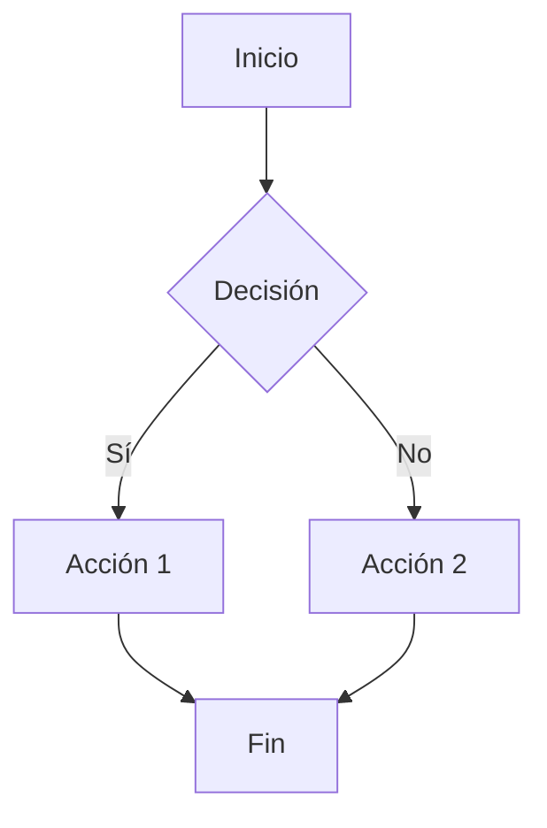

# Prueba Exhaustiva de Markdown

## Índice

1. [Encabezados](#encabezados)
2. [Texto y Formateo](#texto-y-formateo)
3. [Listas](#listas)
4. [Enlaces y Referencias](#enlaces-y-referencias)
5. [Imágenes](#imágenes)
6. [Código](#código)
7. [Tablas](#tablas)
8. [Citas](#citas)
9. [Líneas Horizontales](#líneas-horizontales)
10. [HTML Embebido](#html-embebido)
11. [Caracteres Especiales](#caracteres-especiales)
12. [Elementos Avanzados](#elementos-avanzados)

---

## Encabezados

# Encabezado H1

## Encabezado H2

### Encabezado H3

#### Encabezado H4

##### Encabezado H5

###### Encabezado H6

# Encabezado H1 Alternativo

## Encabezado H2 Alternativo

## Texto y Formateo

### Texto Básico

Este es un párrafo normal con texto regular.

Este es otro párrafo separado por una línea vacía.

### Énfasis y Formateo

**Texto en negrita**
_Texto en cursiva_
**_Texto en negrita y cursiva_**
**Texto en negrita con guiones bajos**
_Texto en cursiva con guiones bajos_
~~Texto tachado~~

### Formateo Adicional

`Código inline`
<u>Texto subrayado</u>
<mark>Texto resaltado</mark>
<small>Texto pequeño</small>
<sup>Texto superíndice</sup>
<sub>Texto subíndice</sub>

### Saltos de Línea

Este es un párrafo con un
salto de línea forzado.

### Escapado de Caracteres

\*Texto con asterisco literal\*
\`Texto con backtick literal\`
\# Texto con hash literal
\\ Barra invertida literal

## Listas

### Listas No Ordenadas

-   Elemento 1
-   Elemento 2
    -   Subelemento 2.1
    -   Subelemento 2.2
        -   Sub-subelemento 2.2.1
        -   Sub-subelemento 2.2.2
            -   Nivel 4
                -   Nivel 5
                    -   Nivel 6
-   Elemento 3

### Listas con Diferentes Marcadores

-   Elemento con guión

*   Elemento con asterisco

-   Elemento con más

### Listas Ordenadas

1. Primer elemento
2. Segundo elemento
    1. Subelemento 2.1
    2. Subelemento 2.2
        1. Sub-subelemento 2.2.1
        2. Sub-subelemento 2.2.2
            1. Nivel 4
                1. Nivel 5
                    1. Nivel 6
3. Tercer elemento

### Listas con Números Específicos

1. Elemento uno
2. Elemento tres (número específico)
3. Elemento siete
    1. Subelemento
    2. Subelemento con número específico

### Listas de Tareas (GitHub Flavored Markdown)

-   [x] Tarea completada
-   [ ] Tarea pendiente
-   [x] Otra tarea completada
    -   [x] Subtarea completada
    -   [ ] Subtarea pendiente
-   [ ] Tarea final

### Listas Mixtas

1. Elemento ordenado
    - Subelemento no ordenado
    - Otro subelemento
        1. Sub-subelemento ordenado
        2. Otro sub-subelemento
            - Elemento no ordenado anidado
2. Segundo elemento ordenado

### Listas con Párrafos

1. Primer elemento

    Este es un párrafo dentro del primer elemento.

2. Segundo elemento

    Este es otro párrafo con múltiples líneas
    que continúa en la siguiente línea.

    > Una cita dentro de un elemento de lista.

3. Tercer elemento

### Listas con Código

1. Elemento con código inline: `console.log('Hello')`
2. Elemento con bloque de código:
    ```javascript
    function hello() {
        console.log("Hello from list");
    }
    ```
3. Elemento normal

## Enlaces y Referencias

### Enlaces Básicos

[Enlace simple](https://www.example.com)
[Enlace con título](https://www.example.com "Título del enlace")
<https://www.example.com>
<email@example.com>

### Enlaces de Referencia

Este es un [enlace de referencia][1] y este es otro [enlace][link-name].

[1]: https://www.example.com
[link-name]: https://www.example.com "Título opcional"

### Enlaces Automáticos

https://www.example.com
email@example.com

### Enlaces Internos

[Ir a Encabezados](#encabezados)
[Ir a Listas](#listas)

## Imágenes

### Imágenes Básicas


### Imágenes de Referencia

![Imagen de referencia][img-ref]

[img-ref]: https://via.placeholder.com/180x120/00CC66/FFFFFF?text=Referencia

### Imágenes con Enlaces

[](https://www.example.com)

## Código

### Código Inline

Este es `código inline` en una oración.
Aquí hay más `código` con `múltiples` segmentos.

### Bloques de Código con Backticks

```
Código sin especificar lenguaje
console.log('Hello World');
```

### Código con Lenguaje Específico

```javascript
function saludar(nombre) {
    console.log(`Hola, ${nombre}!`);
}

saludar("Mundo");
```

```python
def saludar(nombre):
    print(f"Hola, {nombre}!")

saludar("Mundo")
```

```html
<!DOCTYPE html>
<html>
    <head>
        <title>Página de Prueba</title>
    </head>
    <body>
        <h1>Hola Mundo</h1>
    </body>
</html>
```

```css
body {
    font-family: Arial, sans-serif;
    margin: 0;
    padding: 20px;
}

.container {
    max-width: 800px;
    margin: 0 auto;
}
```

```json
{
    "nombre": "Proyecto de Prueba",
    "version": "1.0.0",
    "scripts": {
        "start": "node index.js",
        "test": "jest"
    },
    "dependencies": {
        "express": "^4.18.0"
    }
}
```

```bash
#!/bin/bash
echo "Instalando dependencias..."
npm install
echo "Iniciando servidor..."
npm start
```

```sql
SELECT usuarios.nombre, pedidos.total
FROM usuarios
JOIN pedidos ON usuarios.id = pedidos.usuario_id
WHERE pedidos.fecha > '2023-01-01'
ORDER BY pedidos.total DESC;
```

### Código Indentado (4 espacios)

    Este es código indentado con 4 espacios
    function ejemplo() {
        return 'Hola';
    }

### Código con Números de Línea

```javascript {1,3-5}
console.log("Línea 1"); // Resaltada
console.log("Línea 2");
console.log("Línea 3"); // Resaltada
console.log("Línea 4"); // Resaltada
console.log("Línea 5"); // Resaltada
```

## Tablas

### Tabla Básica

| Columna 1 | Columna 2 | Columna 3 |
| --------- | --------- | --------- |
| Dato 1    | Dato 2    | Dato 3    |
| Dato 4    | Dato 5    | Dato 6    |

### Tabla con Alineación

| Izquierda | Centrado | Derecha |
| :-------- | :------: | ------: |
| Texto     |  Texto   |   Texto |
| Más texto |   Más    |     Más |

### Tabla Compleja

| Producto | Precio | Cantidad | Total | Disponible |
| -------- | ------ | -------- | ----- | ---------- |
| Laptop   | $999   | 2        | $1998 | ✅         |
| Mouse    | $25    | 5        | $125  | ✅         |
| Teclado  | $75    | 1        | $75   | ❌         |

### Tabla con Markdown

| Elemento                      | Descripción      | Código         |
| ----------------------------- | ---------------- | -------------- |
| **Negrita**                   | Texto en negrita | `**texto**`    |
| _Cursiva_                     | Texto en cursiva | `*texto*`      |
| [Enlace](https://example.com) | Enlace web       | `[texto](url)` |

## Citas

### Cita Simple

> Esta es una cita simple.

### Cita Multilínea

> Esta es una cita que abarca
> múltiples líneas y continúa
> en la siguiente línea.

### Citas Anidadas

> Esta es una cita de primer nivel.
>
> > Esta es una cita anidada.
> >
> > > Esta es una cita doblemente anidada.
> >
> > De vuelta al segundo nivel.
>
> De vuelta al primer nivel.

### Citas con Formateo

> **Cita importante**: Esta cita contiene texto en _cursiva_ y **negrita**.
>
> También puede contener `código inline` y [enlaces](https://example.com).

### Citas con Listas

> Elementos importantes:
>
> 1. Primer punto
> 2. Segundo punto
>     - Subelemento
>     - Otro subelemento
> 3. Tercer punto

### Citas con Código

> Ejemplo de código:
>
> ```javascript
> function ejemplo() {
>     return "Hola desde una cita";
> }
> ```

## Líneas Horizontales

---

---

---

---

---

---

## HTML Embebido

### Elementos HTML Básicos

<div>Este es un div HTML</div>

<span style="color: red;">Texto en rojo</span>

<p>Párrafo HTML con <strong>texto fuerte</strong> y <em>texto enfatizado</em>.</p>

### Elementos HTML de Formato

<kbd>Ctrl</kbd> + <kbd>C</kbd> para copiar

<abbr title="HyperText Markup Language">HTML</abbr>

<del>Texto eliminado</del> y <ins>texto insertado</ins>

### Elementos HTML de Lista

<dl>
  <dt>HTML</dt>
  <dd>HyperText Markup Language</dd>
  <dt>CSS</dt>
  <dd>Cascading Style Sheets</dd>
</dl>

### Detalles Colapsables

<details>
  <summary>Haz clic para expandir</summary>
  <p>Este contenido estaba oculto y ahora es visible.</p>
  <ul>
    <li>Elemento 1</li>
    <li>Elemento 2</li>
  </ul>
</details>

<details open>
  <summary>Abierto por defecto</summary>
  <p>Este contenido es visible por defecto.</p>
</details>

## Caracteres Especiales

### Entidades HTML

&amp; &lt; &gt; &quot; &apos;
&copy; &reg; &trade;
&nbsp; &mdash; &ndash;

### Emojis

😀 😃 😄 😁 😆 😅 😂 🤣
❤️ 💙 💚 💛 💜 🧡 🖤 🤍
👍 👎 👏 🙌 👌 ✌️ 🤞 🤝
🔥 💯 ⭐ ✨ 🎉 🎊 🎈 🎁

### Símbolos Especiales

α β γ δ ε ζ η θ
∞ ∑ ∏ ∫ ∂ ∇ ∆ ∅
← → ↑ ↓ ↔ ↕ ↖ ↗
✓ ✗ ✚ ✜ ⚠ ⚡ ⭐ ❌

## Elementos Avanzados

### Notas al Pie (si soportado)

Este texto tiene una nota al pie[^1].

Y este otro texto tiene otra nota[^nota-larga].

[^1]: Esta es la primera nota al pie.
[^nota-larga]:
    Esta es una nota al pie más larga que puede contener múltiples párrafos.

    Incluso puede tener párrafos adicionales.

### Matemáticas (si KaTeX está habilitado)

Matemáticas inline: $E = mc^2$

Bloque matemático:

$$
\int_{-\infty}^{\infty} e^{-x^2} dx = \sqrt{\pi}
$$

Más matemáticas:

$$
\frac{d}{dx} \left( \int_{a}^{x} f(t) dt \right) = f(x)
$$

### Diagramas (Mermaid si soportado)



### Texto Multilínea con Formato

```
    ASCII Art:
    ┌─────────────────────────────────┐
    │         CAJA DE TEXTO           │
    │                                 │
    │  ┌─────┐  ┌─────┐  ┌─────┐     │
    │  │  A  │  │  B  │  │  C  │     │
    │  └─────┘  └─────┘  └─────┘     │
    │                                 │
    └─────────────────────────────────┘
```

### Comentarios HTML (no visibles)

<!-- Este es un comentario HTML que no se renderiza -->

### Caracteres de Escape

\*literalmente asterisco\*
\`literalmente backtick\`
\#literalmente hash\#
\[literalmente corchete\]
\(literalmente paréntesis\)

### Elementos de Formulario HTML

<form>
  <label for="name">Nombre:</label>
  <input type="text" id="name" name="name">

<label for="email">Email:</label>
<input type="email" id="email" name="email">

<label for="message">Mensaje:</label>
<textarea id="message" name="message"></textarea>

<button type="submit">Enviar</button>

</form>

### Elementos de Media

<audio controls>
  <source src="audio.mp3" type="audio/mpeg">
  Tu navegador no soporta audio.
</audio>

<video width="320" height="240" controls>
  <source src="video.mp4" type="video/mp4">
  Tu navegador no soporta video.
</video>

---

## Fin de la Prueba

Este documento contiene prácticamente todos los elementos posibles de Markdown estándar, GitHub Flavored Markdown, y elementos HTML embebidos. Es perfecto para probar la funcionalidad completa de cualquier renderizador de Markdown.

**Nota:** Algunos elementos avanzados como matemáticas, diagramas Mermaid, o notas al pie pueden requerir plugins específicos para renderizarse correctamente.
